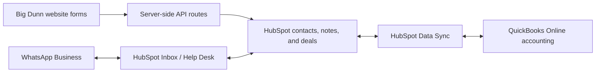

# CRM integration rollout

## Recommended architecture

HubSpot should own leads, customer conversations, sales activity, and deal progress. QuickBooks Online should remain the accounting authority for products, invoices, payments, taxes, and closed periods.

This keeps credentials off the browser and avoids building two custom integrations that HubSpot already supports natively.

## Phase 1: website to HubSpot

Implemented in this repository:

- `/api/contact` validates quote requests, upserts the contact, and creates an associated deal when the pipeline is configured. The complete event brief is written to the deal Description and to a note associated with both the deal and contact. Explicit package starting estimates are written to the deal Amount.
- `/api/subscribe` upserts the contact and records explicit newsletter consent.
- `/api/reviews` upserts the contact and logs the review on the contact timeline.
- The server returns a real error when HubSpot is unavailable; the UI no longer reports false success.
- Honeypot fields and server-side limits reject basic automated form abuse.

Account setup and validation checklist:

1. Create the HubSpot private app and configure the environment variables in `.env.example`.
2. Choose the sales pipeline and the first stage for website quote requests.
3. Choose the HubSpot email subscription type for the newsletter.
4. Submit one approved test quote, subscription, and review. On the quote deal, confirm the Description contains package, services, date/time, venue, guest count, budget, contact preference, and notes; confirm the activity note is visible on both the deal and associated contact.

## Phase 2: WhatsApp Business

Use HubSpot's native WhatsApp channel first. It keeps messages on the contact timeline and lets the team reply from HubSpot instead of introducing another message store.

Current prerequisites and constraints:

- HubSpot Conversations Inbox requires Marketing Hub or Service Hub Professional/Enterprise; Help Desk requires Service Hub Professional/Enterprise.
- A WhatsApp Business Account, Meta Business Manager admin access, and control of the phone number are required.
- Only messages received after connection are imported.
- The standard connection moves messaging into HubSpot. If the same number must remain in the WhatsApp Business app, confirm that the account and number are eligible for WhatsApp coexistence before migrating.
- Customer replies open a 24-hour service window. Outside that window, an approved message template is required to restart the conversation.

Rollout checklist:

1. Confirm the HubSpot subscription tier and whether Inbox or Help Desk will be used.
2. Confirm the WhatsApp Business phone number and whether the mobile app must continue working.
3. Verify the Meta business, connect the channel in HubSpot, and create routing/ownership rules.
4. Create approved templates for quote follow-up, appointment confirmation, deposit reminders, and event-week reminders.
5. After the channel is live, add a website `wa.me` call-to-action using the confirmed business number.

Reference: [HubSpot WhatsApp channel setup](https://knowledge.hubspot.com/help-desk/connect-a-whatsapp-channel-to-help-desk).

## Phase 3: QuickBooks Online

Use HubSpot's native QuickBooks Online Data Sync. It supports contacts/customers, products and services, invoices, credit memos, and payment visibility without storing Intuit OAuth tokens in this website.

Recommended ownership and sync rules:

- Leads remain only in HubSpot until they become billable customers.
- QuickBooks is authoritative for products, SKUs, invoices, payments, taxes, and accounting status.
- Sync products one way from QuickBooks to HubSpot and ensure every product has a unique SKU.
- Use one billing contact per QuickBooks customer to avoid duplicate display-name conflicts.
- Start invoice sync from QuickBooks to HubSpot. Add HubSpot-to-QuickBooks invoice creation only after finance approves the invoice and tax workflow.
- Let QuickBooks win conflict resolution for financial fields, and lock closed accounting periods before enabling sync.
- Review the integration's non-US tax limitation against the exact QuickBooks Bahamas configuration before creating invoices in HubSpot.

Rollout checklist:

1. Have the HubSpot Super Admin and QuickBooks Online administrator connect the official app.
2. Start with customer and product sync using HubSpot's recommended filters.
3. Test with one customer and one SKU before enabling historical or broader sync.
4. Validate invoice numbering, taxes, deposits, processing fees, payment allocation, and closed-period behavior with the bookkeeper.
5. Enable invoice sync in the agreed direction and monitor failed/excluded records during the first week.

Reference: [HubSpot and QuickBooks Online Data Sync](https://knowledge.hubspot.com/integrations/connect-hubspot-and-quickbooks-online).

## When custom APIs would be justified

A direct Meta Cloud API or Intuit OAuth integration is only warranted if the native connectors cannot support a required workflow—for example, a custom WhatsApp bot before HubSpot routing, or specialized QuickBooks transaction types. A custom QuickBooks integration would need encrypted rotating OAuth tokens, webhook signature verification, idempotent processing, and periodic reconciliation; it should not be added to the public website just to duplicate native data sync.
